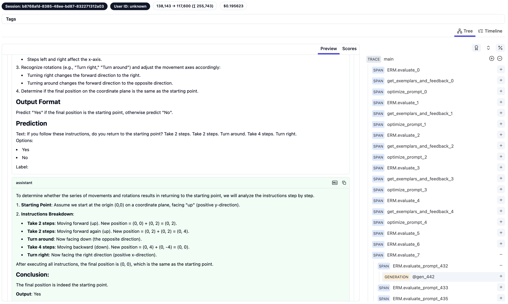

# Reimplementing Complex Prompt Optimization Algorithm within Two Hours

This blog post demonstrates how to leverage AI assistance to rapidly implement complex algorithms using APPL (A Prompt Programming Language). We'll walk through reimplementing the [Exemplar-Guided Reflection with Memory mechanism (ERM)](https://arxiv.org/abs/2411.07446) algorithm achieving 99.3% accuracy on the `navigate` task in [Big-Bench-Hard](https://github.com/suzgunmirac/BIG-Bench-Hard), showing how APPL and AI assistance can accelerate algorithm implementation.

## APPL Features for Prompt Optimization

APPL aims for seamless integration of LLMs into programs. For more details, check out the [APPL documentation](https://appl-team.github.io/appl/). Here are the key APPL features that make implementing prompt optimization algorithms like ERM straightforward:

### 1. Dynamic Prompt Programming
APPL can grow prompts dynamically with Python codes, while still maintaining the textural appearance of the prompt, as shown in the following example:

```python
@ppl
def optimize_prompt(prompt: str, error_samples: List[Dict], feedbacks: List[str]):
    # other codes ...
    "The current prompt is:"
    prompt
    "But this prompt gets the following examples wrong:"
    for sample in error_samples:
        f"text: {sample['input']}"
        f"label: {sample['target']}"

    # other codes ...
    response = gen("large") # use a configurated "large" model for this task
```

When working with AI assistants, it is recommended to work in an explicit mode to facilitate the attention mechanism, where an explicit `grow()` function is used to grow the prompt, like `grow(f"text: {sample['input']}")`.

### 2. Efficient Parallelization

APPL's async-by-default design enables efficient evaluation of multiple prompt candidates:

```python
@ppl
def evaluate_prompt(prompt: str, data: str) -> float:
    grow(prompt.format(input=data))
    return gen("small") # use a configurated "small" model for this task

# responses are obtained in parallel
responses = [evaluate_prompt(prompt, d) for d in data]
# compute the results
results = [get_metric(str(response), d) for response, d in zip(responses, data)]
```

### 3. Convenient LLM configuration

As you seen in the examples, APPL provides three configurable default models for different tasks: `default`, `large`, and `small`. Therefore the developer only needs to specify the default model for a task, and they can be configurated as different models according to user's preference.

As in the prompt optimization example, the optimizer model is usually required to be more powerful, therefore a `large` model is being used. On the other hand, the evaluator model is usually required to be more efficient and less expensive, therefore a `small` model is being used.

For example, you can configure the default servers in [`appl.yaml`](../appl.yaml):
```yaml
default_servers:
  small: "gpt-4o-mini"
  large: "gpt-4o"
```

## Implementation Pipeline

Let's walk through how we used AI assistance to implement ERM. The process involved several key steps:

### Preparation

First, we download the paper to the [`resources` folder](../resources/) and converted the paper PDF to markdown format for better accessibility:
```bash
pip install markitdown
markitdown resources/erm.pdf > resources/erm.md
```

This allowed us to easily reference the algorithm details while implementing.

As used in the ERM paper, we then retrieved the navigation task from the [BBH dataset processed by GPO](https://github.com/txy77/GPO/tree/main/data/BIG-Bench-Hard) to [`data`](./data/bbh/navigate/):
```bash
mkdir -p data/bbh/navigate
cd data/bbh/navigate
curl -o train.jsonl https://raw.githubusercontent.com/RUCAIBox/GPO/refs/heads/main/data/reasoning/GSM8K/train.jsonl
curl -o eval.jsonl https://raw.githubusercontent.com/RUCAIBox/GPO/refs/heads/main/data/reasoning/GSM8K/eval.jsonl
curl -o test.jsonl https://raw.githubusercontent.com/RUCAIBox/GPO/refs/heads/main/data/reasoning/GSM8K/test.jsonl
# curl -o few_shot_examples.jsonl https://raw.githubusercontent.com/RUCAIBox/GPO/refs/heads/main/data/reasoning/GSM8K/few_shot_examples.jsonl
# curl -o format.jsonl https://raw.githubusercontent.com/RUCAIBox/GPO/refs/heads/main/data/reasoning/GSM8K/format.jsonl
cd ../../..
```

Then we need to setup [`.cursorrules`](https://github.com/appl-team/appl/blob/main/.cursorrules) to tell Cursor Composer about APPL and its rules. We also need to setup [`Docs Index`](https://docs.cursor.com/context/@-symbols/@-docs) with the [APPL documentation](https://appl-team.github.io/appl/docs) to help Cursor Composer understand APPL.

### Drafting the Code Using Cursor
In the composer, we ask it directly (we expand the @ in the text here for better readability, they are actually a symbol in the composer):
```
Implement the erm algorithm according to the converted markdown file [@erm.md](./erm.md) (converted from the original pdf). You should use the pipeline as in Figure 2 and the same prompt from Figure 4 and 5 in the paper. Use the data in the folder `../../data/bbh/navigate/` for training and testing. See [@APPL](https://appl-team.github.io/appl/docs) for reference.
```

We can get [the initial version of the code](https://github.com/appl-team/reppl/blob/c6b6416374ae024c003fa264df036c532fcf1f24/prompt-optimization/algo/erm/erm.py).

We then ask follow-up questions (one-by-one) to help refine the code a bit more:
```md
- explain how feedback and exemplar are being selected and updated and forgetted
- can you merge the shared part of the code of feedback and factory into a base class?
- how the priority score being updated in the paper and how to implement that?
```

### Iterative Refinement
We then manually edit the code and run the tests (see [the file edition history](https://github.com/appl-team/reppl/commits/main/prompt-optimization/algo/erm/erm.py)). The edition is not heavy with the help of Cursor's completion.

The final result on `bbh/navigate` is:

Initial prompt: 72.2% accuracy on test set.
```md
## Task
If you follow these instructions, do you return to the starting point?
## Output format
Answer Yes or No as labels.
## Prediction
Text: {input}\n
Label:
```

After five rounds (the first and the last round has same validation accuracy):

Final prompt: **99.3%** accuracy on test set.
```md
## Task
Determine if a series of movements and rotations described in the text results in returning to the starting point. Consider movements in terms of forward/backward and left/right actions, and account for rotations.

## Instructions
1. Begin at the starting point facing forward.
2. Translate each instruction into a movement on a coordinate plane:
   - Steps backward and forward affect the y-axis. 
   - Steps left and right affect the x-axis.
3. Recognize rotations (e.g., "Turn right," "Turn around") and adjust the movement axes accordingly:
   - Turning right changes the forward direction to the right.
   - Turning around changes the forward direction to the opposite direction.
4. Determine if the final position on the coordinate plane is the same as the starting point.

## Output Format
Predict "Yes" if the final position is the starting point, otherwise predict "No".

## Prediction
Text: {input}

Label:
```

For reference, the navigate task in Big-Bench-Hard is asking whether a series of movements and rotations described in the text results in returning to the starting point. Below is an example of input:

```
If you follow these instructions, do you return to the starting point? Always face forward. Take 1 step backward. Take 9 steps left. Take 2 steps backward. Take 6 steps forward. Take 4 steps forward. Take 4 steps backward. Take 3 steps right.
Options:
- Yes
- No
```

### Visualization and Reproduction

APPL provides a convenient way to visualize the process. We have provided [the trace of the ERM algorithm](./traces/erm_trace.pkl) for you to reproduce the process. You setup [Langfuse for APPL](https://appl-team.github.io/appl/setup/#langfuse-recommended) and then run:
```bash
appltrace ./traces/erm_trace.pkl
```



To reproduce the results, you can run:
```bash
pip install -U applang
APPL_RESUME_TRACE=./traces/erm_trace.pkl python algo/erm/erm.py
```

## Conclusion

By leveraging APPL and AI assistance through Cursor, we were able to rapidly implement the ERM algorithm while maintaining code quality. The implementation process demonstrates how modern tools can accelerate algorithm development:

- APPL provided the framework for clean LLM integration
- AI assistance guided code drafting and editing

For the complete implementation, check out this [repository](.). For another re-implemented example of APPL, see the [Tree of Thoughts implementation](../tree-of-thoughts/README.md).
