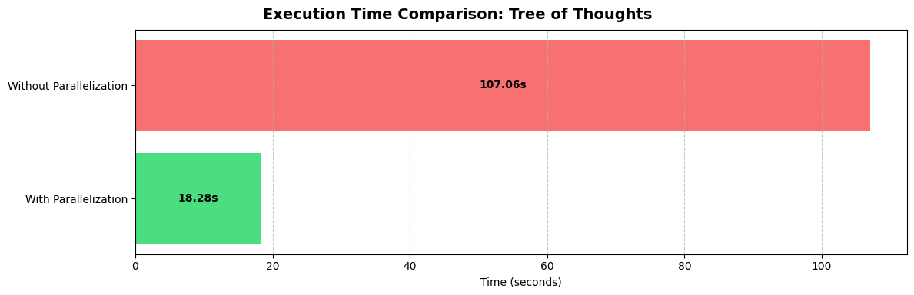
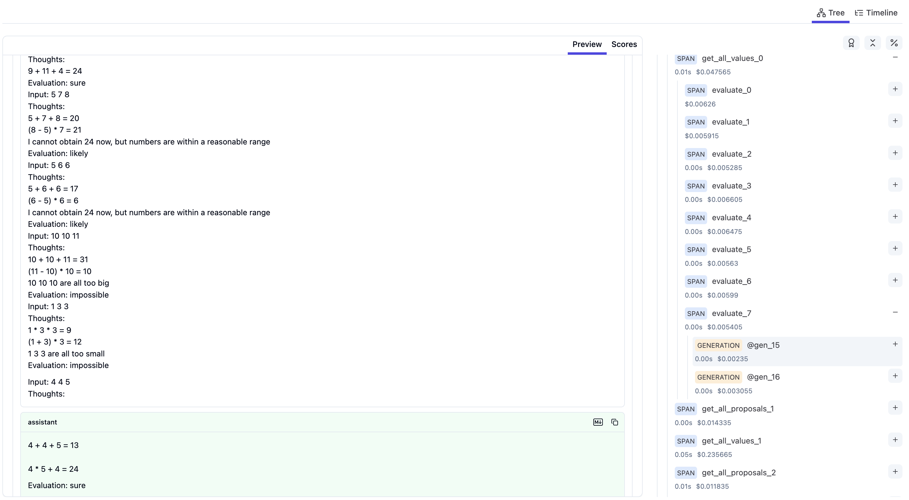

# Tree of Thoughts Re-implementation

This is a re-implementation of the Tree of Thoughts (ToT) reasoning framework using [APPL](https://github.com/appl-team/appl). The implementation focuses on solving the Game of 24 task, where the goal is to construct an expression that evaluates to 24 using four given numbers and basic arithmetic operations.

## Features

The implementation is benefited from the following features of APPL:

- Seamless integrate prompts into programs
  - ```python
    @ppl
    def evaluate(current_numbers: str, n_evaluate_sample: int = 3):
        "Evaluate if given numbers can reach 24 (sure/likely/impossible)"
        display_examples(VALUE_EXAMPLES)
        f"Input: {current_numbers}"
        "Thoughts:"
        return [gen() for _ in range(n_evaluate_sample)]
    ```
- Parallelized LLM calls
  - The parallelized LLM calls is 6x faster than the sequential calls.
  - 
- Trace visualization (using Langfuse) and resuming
  - 
  - When debugging one functionality (e.g. the final answer generation step), you can benefit from loading the trace of the previous runs without re-running the expensive LLM calls for proposal generation and evaluation.

## Installation

```bash
git clone https://github.com/appl-team/reppl.git
cd tree-of-thoughts
pip install re-tot
# or pip install -e .
```

## Usage

To run the solver, use the following command:

```bash
tot-solve --data-path data/24.csv --task-start-index 900 --task-end-index 901 --n-propose-sample 8 --n-evaluate-sample 2 --n-select-sample 5
```

To resume a trace, use the following command:

```bash
APPL_RESUME_TRACE=<the-path-to-the-trace-file> tot-solve ...
# E.g.
# APPL_RESUME_TRACE=./traces/tot-solve.pkl tot-solve --task-end-index 910
```

To visualize the trace, you need to setup Langfuse following this [guide](https://appl-team.github.io/appl/tutorials/7_tracing/#langfuse-recommended), then use the following command:
```bash
appltrace <the-path-to-the-trace-file>
# E.g.
# appltrace ./traces/tot-solve.pkl
```

### Command Line Arguments

- `--data-path`: Path to the Game24 dataset CSV file (default: data/24.csv)
- `--task-start-index`: Start index of tasks, inclusive (default: 900)
- `--task-end-index`: End index of tasks, exclusive (default: 901)
- `--n-propose-sample`: Number of proposals to generate (default: 8)
- `--n-evaluate-sample`: Number of evaluations to generate (default: 2)
- `--n-select-sample`: Number of proposals to select (default: 5)

## Example Results

Running the solver on 10 tasks (index 900-910) with default parameters:
```bash
# You can use the saved trace to reproduce the results without actually running the LLM calls
APPL_RESUME_TRACE=./traces/tot-solve.pkl tot-solve --task-end-index 910
```

Results:
```
[Summary] Solved 6 out of 10 tasks, solved rate: 0.6
```

## Implementation Details

The solver follows the Tree of Thoughts approach with three main components:

1. **Thought Proposal**: Generates potential solution paths using LLM
2. **Thought Evaluation**: Evaluates the quality of proposed solutions
3. **Thought Selection**: Selects the most promising solutions to explore further

Each step is implemented using APPL's prompting system, allowing for clear separation of concerns and maintainable prompt engineering.
The caching is also implemented for both the generation and evaluation steps across different tasks.

## License

MIT
